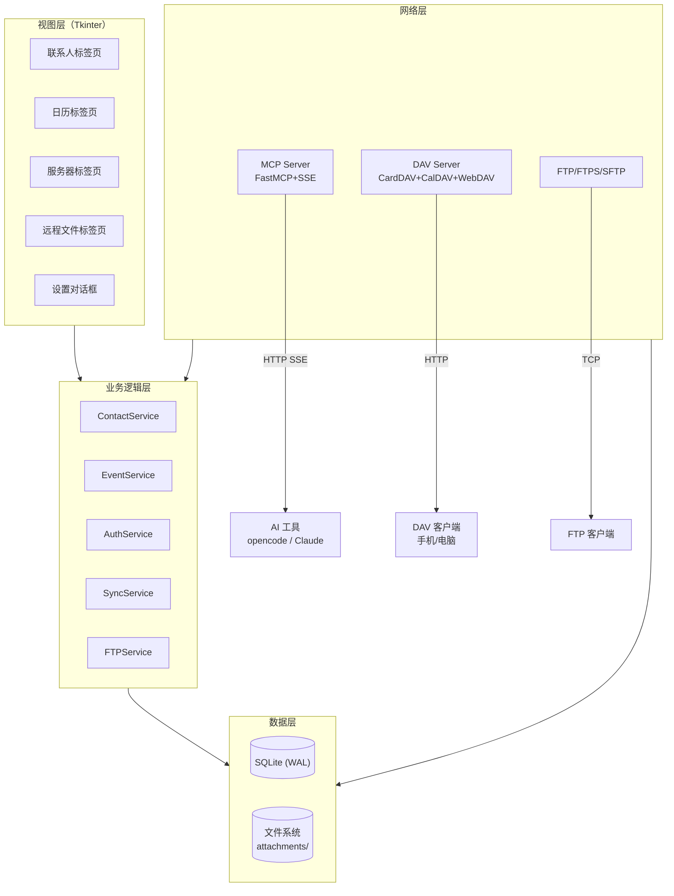

# PersonalDAV - 全能 DAV 服务 + MCP

PersonalDAV 是一个带图形界面的全能 DAV 服务，集 CardDAV（联系人）、CalDAV（日历事件）和 WebDAV 于一体，支持通过 MCP（模型上下文协议）让 AI 直接操作您的数据。所有数据本地存储，无需订阅任何云服务。

> [!NOTE]
> 由于学习原因, 本项目的开发速度会有所缓慢。

> [!IMPORTANT]
> 使用前请阅读[免责声明](DISCLAIMER.md)。本软件按「原样」提供，作者不对数据丢失或安全问题承担责任。

## 功能特性

- 🧑 **联系人管理** — 创建、编辑、删除联系人，支持vCard格式，支持头像照片
- 📎 **事件附件** — 为日历事件添加文件或链接附件，支持 base64 内联存储
- 📅 **日历事件管理** — 创建、编辑、删除日历事件，支持iCalendar格式，支持重复事件
- 🔄 **CardDAV + CalDAV + WebDAV** — 通过HTTP提供标准DAV服务，支持手机/电脑客户端同步
- 📤 **导入/导出** — 支持从vCard(.vcf)/iCalendar(.ics)文件或URL导入，支持导出选中数据
- 🤖 **MCP 服务** — 支持 AI（opencode、Claude 等）直接通过 MCP 协议管理您的联系人和日历
- 🔒 **统一密码保护** — 一个密码同时保护 WebDAV 和 MCP 服务，支持 PBKDF2 安全加密
- 🗜️ **数据库压缩** — 删除数据后空闲空间不浪费，可在设置页手动压缩或启动时自动整理
- 🛡️ **IP 访问控制** — 白名单/黑名单/CIDR/通配符，支持本机免密码
- 📋 **鉴权日志** — 登录成功/失败均有日志记录，可溯源
- 📂 **FTP / FTPS / SFTP 文件服务** — 一键启动文件传输服务器，支持端口和根目录配置
- 🌐 **SMB / CIFS 网络共享** — 连接远程 SMB 服务器，浏览目录、挂载共享
- 🌐 **WebDAV 文件服务 `/dav/`** — 通过 WebDAV 协议远程管理文件，支持 PROPFIND/GET/PUT/DELETE/MKCOL
- 🗂️ **远程文件浏览器** — 图形化浏览 FTP/FTPS/SFTP/SMB 远程文件，支持上传下载删除重命名
- 📅 **日历月视图** — 按月份查看日程，点击日期查看详细事件，支持年份/月份下拉框快速跳转
- 🖥️ **友好的GUI** — 图形界面操作，支持拖拽导入，所有窗口居中显示
- 💾 **本地存储** — 使用SQLite存储数据，无需额外配置
- 🔍 **类型安全** — 新代码强制 mypy --strict，持续提升代码质量
- 🌐 **跨平台** — 支持Windows、macOS和Linux

## 安装与运行

### 前提条件

- Python 3.10+

### 安装步骤

1. 克隆仓库或下载源代码：
   ```bash
   git clone https://github.com/hunyanjie/PersonalDAV.git
   cd PersonalDAV
   ```

2. 安装依赖：
   ```bash
   pip install -e .
   ```

   如需开发（运行测试），额外安装：
   ```bash
   pip install -e ".[dev]"
   ```

3. 运行程序：
   ```bash
   python main.py
   ```

### 运行测试

```bash
python tests/run_all.py
```

依次执行：pytest 单元测试（23 项）→ MCP 内部工具测试（32 个工具）→ MCP HTTP 端到端测试（走 SSE 协议）→ MCP 鉴权测试（401/403/200 + 日志落盘）。

## 使用指南

### 服务器管理

1. 在"服务器管理"标签页中，设置端口号（默认为8000）
2. 点击"启动服务器"按钮
3. 服务器启动后，您将看到各协议对应的配置地址

### 联系人管理

1. 在"联系人"标签页中，您可以：
    - 添加、编辑、删除联系人
    - 导入/导出联系人
    - 查看联系人原始数据

### 日历事件管理

1. 在"日历事件"标签页中，您可以：
    - 添加、编辑、删除日历事件
    - 导入/导出日历事件
    - 查看事件原始数据

### 安全设置

1. 在"设置 → 安全设置"中：
    - 设置统一访问密码（PBKDF2 加密）
    - 开启 TOTP 双因素认证（兼容 Google Authenticator / Authy）
    - 复制 MCP 令牌供 AI 连接
    - 配置 IP 黑白名单
    - 开启/关闭本机免密码
    - 配置指定 IP 免密码访问

### MCP 服务

1. 在"设置 → MCP 服务"中启用 MCP 服务
2. 在 opencode 或支持 MCP 的 AI 工具中配置：

   ```json
   {
     "mcp": {
       "personal-dav": {
         "type": "remote",
         "url": "http://127.0.0.1:8100/sse"
       }
     }
   }
   ```

3. 如果设置了密码，还需要添加 `Authorization: Bearer <令牌>`（令牌从安全设置页复制）

## 客户端配置

> 如果设置了访问密码，客户端需要输入密码（用户名任意）。

### CardDAV 配置

- 服务器地址: `http://localhost:8000/contacts/`
- 用户名: (任意)
- 密码: (访问密码，如已设置)

### CalDAV 配置

- 服务器地址: `http://localhost:8000/events/`
- 用户名: (任意)
- 密码: (访问密码，如已设置)

## MCP 可用工具

MCP 服务提供 33 个工具供 AI 调用：

| 工具 | 说明 |
|------|------|
| `server_start` / `server_stop` / `server_status` | 管理 DAV 服务器启停和状态查询 |
| `list_contacts` / `get_contact` | 查看联系人列表和详情 |
| `create_contact` / `update_contact` / `delete_contact` | 联系人增删改 |
| `create_contact_v2` | 通过结构化参数（姓名、邮箱、电话）创建联系人，无需拼接 vCard |
| `list_events` / `get_event` | 查看事件列表和详情 |
| `create_event` / `update_event` / `delete_event` | 事件增删改 |
| `get_config` | 查询软件配置和统计数据 |
| `dav_health_check` | 验证 DAV 服务器是否正常工作（含 `/dav/` 端点） |
| `ftp_servers_start` / `ftp_servers_stop` / `ftp_servers_status` | 管理 FTP/SFTP/TFTP 文件服务器启停和状态 |
| `ftp_list_dir` / `ftp_download` / `ftp_upload` | 远程 FTP/SFTP 目录浏览、文件下载和上传 |
| `ftp_delete` / `ftp_rename` / `ftp_mkdir` / `ftp_rmdir` | 远程 FTP/SFTP 文件/目录删除、重命名、创建、移除 |
| `smb_list_shares` / `smb_list_files` | 查看 SMB 服务器上的共享目录和文件列表 |
| `dav_list_files` / `dav_upload` / `dav_download` | WebDAV 文件浏览、上传、下载 |
| `dav_delete` / `dav_mkdir` | WebDAV 文件删除和目录创建 |

## 项目架构

```
PersonalDAV/
├── main.py                  # 入口（TkinterDnD 主窗口）
├── config.py                # 软件元信息
├── data/                    # 运行产物（自动创建）
│   ├── dav_data.db          # SQLite 数据库
│   ├── remote_connections.key # Fernet 加密密钥
│   ├── attachments/         # 附件独立文件存储
│   └── log/                 # 日志文件
├── mcp_tools/               # MCP 工具模块（分文件管理）
├── models/                  # 数据模型层（dataclass）
├── database/                # 数据访问层（SQLite + Repository）
│   └── repositories/        # 泛型 CRUD 仓储
├── services/                # 业务逻辑层
│   ├── base_service.py      # 泛型 Serivce 基类
│   ├── auth_service.py      # 统一鉴权（PBKDF2 + IP 访问控制）
│   ├── mcp_server.py        # MCP SSE 服务器
│   ├── ftp_service.py       # FTP/FTPS/SFTP/TFTP 服务器
│   ├── sync_service.py      # Nextcloud 定时同步
│   └── ...
├── network/                 # 网络层
│   ├── dav_server.py        # CardDAV + CalDAV + WebDAV HTTP 服务
│   ├── dav_client.py        # WebDAV 客户端（远程导入）
│   └── webdav_helper.py     # XML 响应构建
├── ui/                      # 视图层（Tkinter）
│   ├── app.py               # 主窗口 / 菜单 / 事件总线
│   ├── tabs/                # 标签页（联系人/日历/服务器/远程）
│   ├── dialogs/             # 对话框（设置/事件/联系人/向导/确认）
│   └── widgets/             # 自定义控件（Toast/右键菜单/工具提示）
├── utils/                   # 工具层
│   ├── validators.py        # 端口/IP/密码强度校验
│   ├── attachment_store.py  # 附件文件存储管理
│   ├── crypto.py            # Fernet 加密
│   └── ...
└── tests/                   # 测试（pytest：23 项/325 子测试）
```



## 技术栈

| 层面 | 技术 |
|------|------|
| GUI 框架 | Tkinter / ttk / tkinterdnd2 |
| 数据库 | SQLite (WAL 模式 + 线程安全) |
| DAV 协议 | Python 内置 HTTPServer（无外部依赖） |
| MCP 服务 | FastMCP + Uvicorn (SSE 协议) |
| 加密 | PBKDF2-HMAC-SHA256（密码）、Fernet/AES-128-CBC（远程连接密码） |
| 数据格式 | vCard 3.0 / iCalendar 2.0 |
| 时区 | pytz / tzlocal / Babel |
| 网络协议 | HTTP/WebDAV、FTP/FTPS、SFTP、TFTP、SMB/CIFS |
| 测试 | pytest + tracemalloc + 像素截图对比 |

## 注意事项

- 该服务仅设计用于本地网络或个人使用
- 开启密码后请妥善保管，密码丢失无法找回
- 请勿在公共网络环境中使用，建议配合 IP 白名单 + 强密码

## 贡献

欢迎贡献代码、报告问题或提出建议！

### 报告问题

- 搜索 [Issues](https://github.com/hunyanjie/PersonalDAV/issues) 确认是否已有相同报告
- 提供复现步骤、操作系统、Python 版本等信息
- 如有相关日志，一并附上

### 提交 Pull Request

1. Fork 仓库并创建特性分支
2. 确保代码风格一致（参考现有代码）
3. 运行测试确保不破坏现有功能：`python tests/run_all.py`
4. 提交 PR 时说明改动目的和实现方式

### 开发环境

```bash
pip install -e ".[dev]"
python tests/run_all.py   # pytest 23 项 + MCP 测试 + 鉴权测试
```

### 代码规范

- Python 3.10+，使用类型注解
- 新代码须通过 `mypy --strict` 检查
- 导入顺序：标准库 → 第三方 → 本地模块
- 类名 `PascalCase`，函数/变量 `snake_case`
- 提交消息格式：`类型(模块): 描述`（`feat` `fix` `refactor` `perf` `docs` `test` `chore`）

### 想提意见？

支持[提issue](https://github.com/hunyanjie/PersonalDAV/issues)。

## 免责声明

使用前请阅读完整的[免责声明](DISCLAIMER.md)。简言之：

- 本软件按「原样」提供，无任何明示或暗示保证
- 作者不对数据丢失、泄露或任何损害承担责任
- 用户应自行做好数据备份
- 不建议将本软件暴露到公网

## 许可证

本项目采用 **Apache License Version 2.0**。

### 为什么选择 Apache 2.0？

Apache 2.0 是**宽松许可证**，没有 copyleft 约束：

| 维度 | 说明 |
|------|------|
| ✅ **自由使用** | 可自由使用、修改、分发，无论个人还是商业 |
| ✅ **无需开源衍生代码** | 修改后不必公开源代码（与 GPL/MPL 不同） |
| ✅ **专利保护** | 包含明确的专利授权，贡献者自动授予专利许可 |
| ✅ **兼容性好** | 与 GPL v3 兼容，广泛用于开源生态 |
| ❌ **无 copyleft** | 修改者没有义务回馈改进到社区 |

### 对本项目而言

- **如果您在个人/公司项目中使用**：直接引用无需开源
- **如果您分发修改版本**：保留 Apache 2.0 声明即可，修改部分无需公开
- **专有代码可单独存在**：不受影响

完整许可证文本见 [LICENSE](LICENSE) 文件，或访问 [https://apache.org/licenses/LICENSE-2.0](https://apache.org/licenses/LICENSE-2.0)。

---

通过PersonalDAV，您可以完全掌控自己的联系人、日历和文件数据，无需依赖任何第三方服务。
